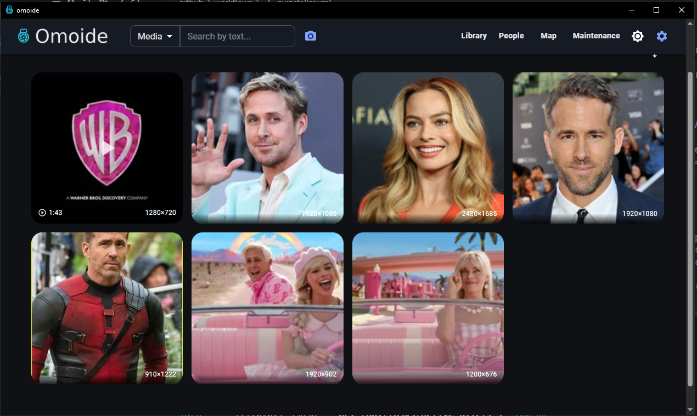

<div align="center">
  
</div>

# Smart Media Organizing Library

Self‑hosted, offline‑capable photo & video library with AI features. No cloud services required. Everything runs locally after an initial one‑time model setup.

<a href="https://photos.dummer.dev">Read‑only Demo</a>



---

## Highlights

- **Offline by design:**
  - Uses SQLite + sqlite‑vec for metadata and vector search. No external DB.
  - Runs face detection, clustering, tagging, and semantic search locally.
  - After first‑run model downloads, the app works fully offline.

- **Face recognition & people:**
  - Detects faces (InsightFace), stores thumbnails and embeddings.
  - Clusters faces into people using HDBSCAN; assign names; browse appearances.

- **Semantic search & auto‑tagging:**
  - OpenCLIP embeddings enable multi‑lingual text → image search and “search by image”.
  - Optional auto‑tagging suggests broad scene/subject tags; add your custom tags.

- **Duplicates & similarity:**
  - Perceptual hash (pHash) to find exact/near‑exact image duplicates.
  - Vector similarity for “more like this”.

- **Maps & EXIF:**
  - Extracts EXIF; shows media on a world map; edit/add GPS in the UI.

- **Profiles:**
  - Switch between libraries (“profiles”). Safe fallback if a profile path is missing.

- **Desktop or Docker:**
  - Packaged desktop app (PyInstaller + PySide6/WebView) or Docker container.

---

## Features

- **Library**: Infinite‑scroll grid for photos and videos; per‑item detail with faces, tags, EXIF, scenes.
- **Face pipeline**: Detect → embed → cluster persons; assign names; view person pages and appearances.
- **Search**:
  - Text search (multi‑lingual via CLIP) over your media embeddings.
  - “Search by image” uploads a reference picture and finds similar content.
- **Auto‑tagging**: Optional CLIP‑based category tags + custom tag support.
- **Duplicates**: pHash duplicate groups with select/cleanup actions.
- **Video scenes**: Scene thumbnails and representative frames.
- **EXIF & GPS**: Read EXIF; add/update GPS; map view of media locations.
- **Tasks**: Background tasks for scan, process media, cluster persons, find duplicates, clean missing files. Safe cancel and progress reporting.
- **Profiles**: Multiple library roots; add/switch/remove profiles from Settings.
- **Read‑only mode**: Serve an immutable library safely.

---

## Offline Operation

- After first run, all processing happens locally. What is needed initially:
  - CLIP model weights (OpenCLIP) for embeddings/search/auto‑tagging.
  - InsightFace ONNX models for detection/recognition.
  - FFmpeg binaries available in PATH (desktop). Docker image includes FFmpeg.
- Models are cached under your profile’s `.omoide/models` directory. You can pre‑place models there to avoid any network access.
- Vector search uses the bundled `sqlite‑vec` extension; no external services.

---

## Quick Start (Docker)

> For arm64, ensure `sqlite‑vec` matches your platform (e.g. 0.1.7a2) and build with `docker buildx build --platform linux/arm64 …`.

1) Copy env file:

```bash
cp .env.template .env
```

2) Adjust variables in `.env` (host media/data dirs, ports).

3) Start:

```bash
docker compose up -d
```

4) Open: http://localhost:8123

---

## Quick Start (Desktop)

- Requirements: Python 3.12+, FFmpeg in PATH, Node 18+ (to build the UI), platform toolchain.
- Build frontend then run locally or build a binary:

```bash
# Build frontend
cd frontend && npm ci && npm run build && cd ..

# Run from source
uvicorn app.main:app --host 127.0.0.1 --port 8123

# Or build a binary (PyInstaller)
pyinstaller main.spec
dist/omoide-*/omoide-*.exe
```

On first start, open Settings → Profiles and set your media folder(s). Click Scan, then Process Media, then Cluster Persons.

---

## Screenshots

> Placeholder images — replace with real screenshots before release.

- Library grid: `docs/screenshots/library-grid.png`
- Media detail (faces, tags, EXIF): `docs/screenshots/media-detail.png`
- Search by text: `docs/screenshots/search-text.png`
- Search by image: `docs/screenshots/search-image.png`
- People overview: `docs/screenshots/people-list.png`
- Person detail: `docs/screenshots/person-detail.png`
- Duplicates: `docs/screenshots/duplicates.png`
- Map view: `docs/screenshots/map.png`
- Orphan faces review: `docs/screenshots/orphan-faces.png`
- Configuration / Profiles: `docs/screenshots/settings-profiles.png`

---

## How It Works (Tech Overview)

- Backend: FastAPI + SQLModel (SQLite/WAL), `sqlite‑vec` for vector search.
- Embeddings: OpenCLIP (CPU by default) via `open‑clip‑torch`.
- Faces: InsightFace with ONNXRuntime (CPU), stored as normalized vectors.
- Clustering: HDBSCAN groups faces into people.
- Similarity: cosine distances in `media_embeddings` and `face_embeddings` virtual tables.
- Thumbnails/Scenes: FFmpeg extracts frames for images/videos.
- UI: React + MUI; desktop uses PySide6 + pywebview to embed the UI.

---

## Tips & Troubleshooting

- FFmpeg must be available to generate thumbnails and probe media (Docker image includes it).
- Profiles: if a previously selected profile path is missing, the app falls back to a safe local profile instead of crashing; relink from Settings.
- Large scans: scanning is batched and uses path range preloads for speed; model downloads can take time on first run.

---

## License

- Project license: PolyForm Noncommercial License 1.0.0. See `LICENSE.md`.
- Third‑party software remains under its own licenses. See `THIRD_PARTY_NOTICES.md`.

Noncommercial only: You may use, run, modify, and share this project for non‑commercial purposes, but commercial use is not permitted under this license.

## Redistribution Notes (Binaries and Docker)

- Binaries (PyInstaller):
  - The application may bundle Qt/PySide6 components. PySide6 is licensed under LGPL‑3.0.
  - Include copies of the LGPL‑3.0 and relevant Qt/PySide6 license texts in your distribution, allow reverse engineering for debugging such modifications, and ensure dynamic linking to Qt libraries (PyInstaller typically bundles shared libraries).
  - If you include Apache‑2.0 components with `NOTICE` files (e.g., some ML libraries), include their `NOTICE` content.

- Docker Image:
  - The image installs `ffmpeg` via Debian packages. FFmpeg’s licenses and notices are included in the image (e.g., `/usr/share/doc/ffmpeg/`). Preserve those when redistributing the image and comply with the license terms for enabled codecs.
  - The image contains additional third‑party packages installed via `uv` (Python). Refer to `THIRD_PARTY_NOTICES.md` for attribution and consider including generated license reports in releases.

## Third‑Party License Reports (Optional)

For precise attribution per release, you can generate machine‑readable reports:

- Python:
  - `uv pip install pip-licenses`
  - `uv run pip-licenses --with-system --format=markdown --output-file THIRD_PARTY_LICENSES_PY.md`

- Frontend:
  - `npm i -g license-checker`
  - `license-checker --production --summary --json > THIRD_PARTY_LICENSES_JS.json`
